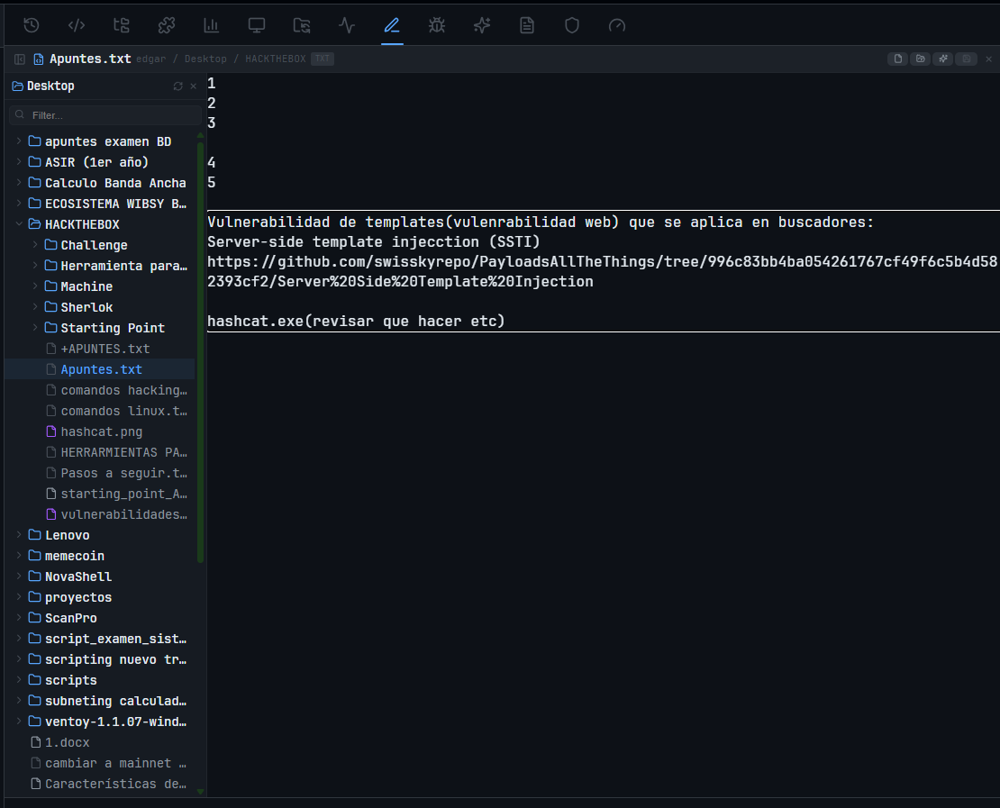
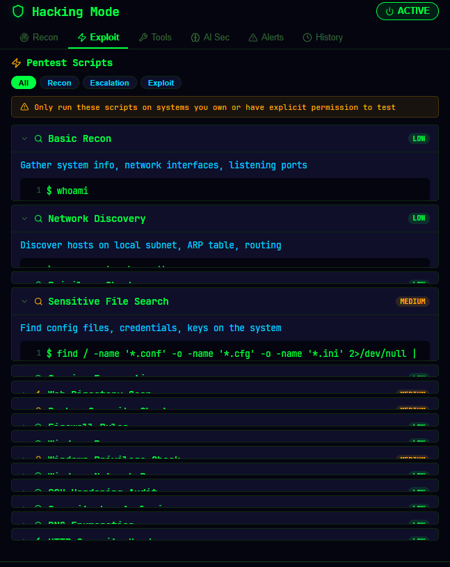

<div align="center">


# NovaShell

### **The terminal that thinks like a sysadmin.**

A modern, cross-platform terminal emulator that bundles SSH, SFTP, RDP, code editing, infrastructure monitoring, AI assistance and pentest tooling — all in a single native app.

[](LICENSE)
[](https://github.com/FomoDonkey/NovaShell/releases/latest)
[](https://github.com/FomoDonkey/NovaShell/releases)
[](https://github.com/FomoDonkey/NovaShell/releases)
[](https://tauri.app/)
[](https://github.com/FomoDonkey/NovaShell/stargazers)

[**Download**](https://github.com/FomoDonkey/NovaShell/releases/latest) · [**What's New**](#-whats-new-in-v338) · [**Build**](#-build-from-source) · [**Docs**](docs/NovaShell_User_Guide.md)

</div>

---

## Why NovaShell?

Most terminals stop at running commands. **NovaShell is what happens when a terminal grows up into a workstation.**

- **One window for everything**: PowerShell next to a remote SSH session, an SFTP transfer, a remote-desktop launch, an Ollama AI chat — split-screen, tabbed, shared.
- **Sysadmin power-tools out of the box**: live infra monitoring with anomaly detection, disk analyzer, server map, cross-server `cd`, encrypted backup manager.
- **Pentest mode built in**: recon, port scanning, exploit library, AI-assisted hardening — opt-in from a single click.
- **Local-first AI**: Ollama integration. No data leaves your machine.
- **Native, fast, signed**: Rust + Tauri 2. Auto-updates without admin prompts.

---

## Table of Contents

- [What's New in v3.3.8](#-whats-new-in-v338)
- [Feature Tour](#-feature-tour)
  - [Terminal](#terminal)
  - [SSH & SFTP](#ssh--sftp)
  - [RDP One-Click Launcher](#rdp-one-click-launcher--new)
  - [Code Editor](#code-editor)
  - [Infrastructure Monitor](#infrastructure-monitor)
  - [Hacking Mode](#hacking-mode)
  - [Collaborative Sessions](#collaborative-sessions)
  - [Backup Manager](#backup-manager)
  - [AI Assistant](#ai-assistant)
  - [Snippets, Workspaces, Themes](#snippets-workspaces-themes)
- [Install](#-install)
- [Build from Source](#-build-from-source)
- [Tech Stack](#-tech-stack)
- [Keyboard Shortcuts](#-keyboard-shortcuts)
- [Contributing](#-contributing)
- [License](#-license)

---

## What's New in v3.3.8

> Released **2026-05-01**

| | Highlight |
|---|---|
| **RDP** | One-click Remote Desktop launcher. Save host/user/password, click Connect — `mstsc.exe` (Windows), Microsoft Remote Desktop (macOS), or `xfreerdp` (Linux) opens with credentials pre-injected via the OS keychain. Probes existing `TERMSRV/<host>` credentials so it never destroys manually-saved entries. |
| **Collab** | Shared terminal sessions over WebSocket. Host a tab, share a 6-char code, guests join read-only or read/write with built-in chat. |
| **Backups** | Scheduled SFTP backups with rotation, SMTP/Telegram notifications, and history view. |
| **Infra Monitor** | Anomaly detection (mean + 2σ), cross-server correlation, disk analyzer with growth tracking and one-click cleanup. |

Full changelog at [Releases](https://github.com/FomoDonkey/NovaShell/releases).

---

## Feature Tour

### Terminal

Native PTY sessions powered by [portable-pty](https://crates.io/crates/portable-pty) and [xterm.js](https://xtermjs.org/) with the Canvas renderer.

- **Up to 20 tabs**, vertical/horizontal split panes, per-tab shell selector
- **Shells**: PowerShell · CMD · Git Bash · WSL · Bash · Zsh · Fish
- **Truecolor** (xterm-256color), clickable links, in-terminal search
- **History**: 500 entries, filterable, click-to-rerun
- **Bracketed-paste fix** for `nano`/`vim` (no extra spaces)
- **64 KB scrollback** preserved across tab switches
- **Cross-server navigation**: `cd /servers/webserver/var/log` to hop into any saved SSH connection by path

---

### SSH & SFTP

Full-featured SSH client built on `libssh2` with **OpenSSL backend on Windows** (ed25519 keys work — most terminals don't).

| | |
|---|---|
| **Auth** | Password · OpenSSH keys · ed25519 · encrypted keys with passphrase |
| **Storage** | OS keychain (Credential Manager / macOS Keychain / Secret Service) — or session-only |
| **Algorithms** | Modern (curve25519, ECDSA) + legacy (DH-group14-sha1) for old hardware |
| **Performance** | Dual-thread reader+flusher, 60fps batching, mpsc write queue, `RwLock` session map |
| **SFTP** | Dual-pane browser · drag-drop upload · multi-file download · directory sync · remote text editor |

Saved connections live in the SSH panel — one click connects. The same pattern is reused for SFTP and RDP.

---

### RDP One-Click Launcher · NEW

Save Remote Desktop hosts the same way you save SSH connections. Click **Connect** and the platform's native client opens with credentials pre-filled.

| Platform | Behaviour |
|----------|-----------|
| **Windows** | Injects `TERMSRV/<host>` cred via `cmdkey`, launches `mstsc.exe` with a temp `.rdp` file (resolution / fullscreen / multimon / `/admin`), removes both after handshake. **Probes existing credentials first** so we never overwrite the user's manual entries. |
| **macOS** | Writes a `.rdp` file and opens it with Microsoft Remote Desktop via `open -a` (no `rdp://` URL — closes the URL-injection vector). |
| **Linux** | `xfreerdp` with `/from-stdin` password pipe (no leaks via `/proc/<pid>/cmdline`). |

Strict input validation: NUL/CR/LF/`"` rejected everywhere; `\` and `/` banned in host fields; backslashed usernames refused when domain is set explicitly.

---

### Code Editor

Built-in **CodeMirror 6** editor with file browser, folder tree, syntax highlighting and remote-aware save.

<div align="center">

<br/>
<sub><i>Editor panel with collapsible folder tree on the left and tab-style file header.</i></sub>
</div>

- **18+ languages**: JS, TS, Python, Rust, Go, SQL, YAML, JSON, Markdown, HTML, CSS, and more
- **Open from local FS or remote SFTP** — saves are routed back to the original source
- **Live log streaming** from remote files (tail -f over SFTP)
- **AI-assisted analysis** via the Ollama panel: explain code, suggest fixes, refactor

---

### Infrastructure Monitor

Live multi-server dashboard with anomaly detection, alerts, and one-click remediation actions.

| Metric | Detected | Action |
|--------|----------|--------|
| CPU spike | mean + 2σ over 30 samples | Top processes · Kill PID · Open Terminal |
| Memory pressure | thresholded + correlation | Cache info · Open Terminal |
| Disk fill | watermark | Open **Disk Analyzer** (CCleaner-style) |
| Service down | systemd polling | Show all failed · Restart |

- **Cross-server correlation**: 2+ servers alert within 30s → systemic issue flagged
- **Global timeline**: every alert/connection/action logged with timestamps
- **Disk Analyzer**: partition donut charts, 9 cleanup categories (logs, journals, cache, pkgcache, tmp, docker, coredumps, snaps, largest dirs), preview-before-clean, growth tracking between scans

---

### Hacking Mode

A pentest workstation — opt-in from a single click. Switches the theme to neon-green and unlocks a tabbed pentest panel.

<div align="center">

<br/>
<sub><i>Hacking Mode → Exploit tab with the built-in pentest script library, severity badges, and AI Security tab.</i></sub>
</div>

- **Recon**: environment detection, port scanning, banner grabbing, ping sweep, DNS enum, subnet calc, HTTP security headers, WiFi scan
- **Exploit**: built-in script library (Recon · Escalation · Exploit) with custom-script editor and severity badges
- **Tools**: hash calc, encoder/decoder, reverse-shell generator, HTTP forge
- **AI Sec**: Ollama-powered analysis — privilege escalation suggestions, hardening audits, exploit explanations
- **Alerts** + **History**: encrypted session save/load, auto-export to PDF report
- **Scope guard**: every script ships with a "only run on systems you own or have explicit permission to test" banner

---

### Collaborative Sessions

Share a terminal tab with someone else, no external server required.

- **Embedded WebSocket server** in the Tauri backend (no cloud relay)
- **6-char alphanumeric session codes** (no ambiguous chars)
- **Read-only / read-write guest permissions**, kickable from host
- **64 KB scrollback** delivered to late joiners so they see context
- **Built-in chat** sidebar with per-user color
- **Rate-limited auth**: 5 failed attempts per IP → 60s cooldown

---

### Backup Manager

Scheduled SFTP backups with rotation, encryption-friendly transport, and notification fan-out.

- **Per-job schedule** (cron-style or interval)
- **Rotation** (keep last N, prune oldest)
- **Notifications**: SMTP and Telegram, both configurable
- **History view**: every run with size, duration, status, error logs

---

### AI Assistant

100% local via [Ollama](https://ollama.com/). Nothing leaves your machine.

- **Modes**: chat · explain command · generate script · fix error
- **Debug Copilot**: 67 hardcoded error patterns + AI fallback for unmatched errors
- **AI Sec Copilot** (Hacking Mode): privilege escalation, hardening audits
- **Session Documentation**: AI-generated PDFs of your work session, with custom templates
- **Auto-detect models**, prompt to pull missing ones

---

### Snippets, Workspaces, Themes

- **Snippets**: multi-line command sequences, run-modes (`&&` stop-on-error or `;` run-all), folders with custom colors, drag-drop, parameterized variables, **shared folders** (OneDrive/Dropbox/network drive — sync via 3s mtime polling)
- **Workspaces**: save and restore tab layouts, sidebar state, split mode
- **Command Palette** (`Ctrl+K`): fuzzy search across actions, panels, servers, snippets, history
- **5 themes**: Dark · Light · Cyberpunk · Retro · Hacking — plus a custom theme builder
- **2 languages**: English · Spanish (full UI coverage)
- **Auto-updater**: in-app updates with cumulative changelog, no admin prompts

---

## Install

Download the installer for your platform from the [latest release](https://github.com/FomoDonkey/NovaShell/releases/latest):

<div align="center">

| Platform | Format | Notes |
|---|---|---|
| **Windows** | `.exe` (NSIS) or `.msi` | User-folder install · no admin · auto-update |
| **macOS** | `.dmg` (Intel + Apple Silicon) | First-launch: right-click → Open (unsigned) |
| **Linux** | `.deb` · `.rpm` · `.AppImage` | AppImage runs without install |

</div>

> **Windows note**: NovaShell installs in `%LocalAppData%`, so no administrator permissions are needed. Auto-updates download and apply silently.

---

## Build from Source

### Prerequisites

- [Node.js](https://nodejs.org/) **18+**
- [Rust](https://rustup.rs/) (latest stable, **≥ 1.77**)
- [Tauri prerequisites](https://tauri.app/start/prerequisites/) for your OS
- **Windows only**: [Strawberry Perl](https://strawberryperl.com/) (needed by `openssl-src` for the libssh2 OpenSSL backend)

### Steps

```bash
# Clone
git clone https://github.com/FomoDonkey/NovaShell.git
cd NovaShell/nexterm

# Install JS deps
npm install

# Run in dev mode
npm run tauri:dev

# Build a production installer
npm run tauri:build
```

Installers land in `nexterm/src-tauri/target/release/bundle/`.

---

## Tech Stack

<div align="center">

| Layer | Technology |
|-------|------------|
| **Framework** | [Tauri 2](https://tauri.app/) |
| **Frontend** | React 18 + TypeScript + Vite |
| **Backend** | Rust (edition 2021) |
| **Terminal** | xterm.js 5 (Canvas renderer) + portable-pty |
| **Editor** | CodeMirror 6 |
| **State** | Zustand |
| **SSH/SFTP** | libssh2 via `ssh2` crate (OpenSSL backend on Windows for ed25519) |
| **Keychain** | `keyring` v2 (Credential Manager · macOS Keychain · Secret Service) |
| **Collab transport** | `tokio-tungstenite` (embedded WebSocket server) |
| **AI** | [Ollama](https://ollama.com/) (local models) |
| **Icons** | [Lucide React](https://lucide.dev/) |

</div>

---

## Keyboard Shortcuts

| Shortcut | Action |
|---|---|
| `Ctrl/Cmd + K` | Command Palette |
| `Ctrl/Cmd + T` | New tab |
| `Ctrl/Cmd + W` | Close tab |
| `Ctrl/Cmd + Tab` | Next tab |
| `Ctrl/Cmd + \` | Toggle vertical split |
| `Ctrl/Cmd + Shift + \` | Toggle horizontal split |
| `Ctrl/Cmd + F` | In-terminal search |
| `Ctrl/Cmd + +` / `-` | Font size |
| `F11` | Focus mode |

---

## Contributing

Contributions are welcome. Please open an issue first for substantial changes so we can align on direction.

1. Fork the repo
2. `git checkout -b feature/amazing-feature`
3. Commit using the existing convention: `vX.Y.Z — short summary` for releases, `area: short summary` for non-release commits
4. Push and open a PR

---

## License

MIT — see [LICENSE](LICENSE).

---

<div align="center">

**Made with care by [0xArlee](https://github.com/FomoDonkey)**

Powered by [Tauri](https://tauri.app/) · [xterm.js](https://xtermjs.org/) · [CodeMirror](https://codemirror.net/) · [Ollama](https://ollama.com/) · [Lucide](https://lucide.dev/)

<br/>

If NovaShell saves you time, please ⭐ the repo — it really helps.

</div>
